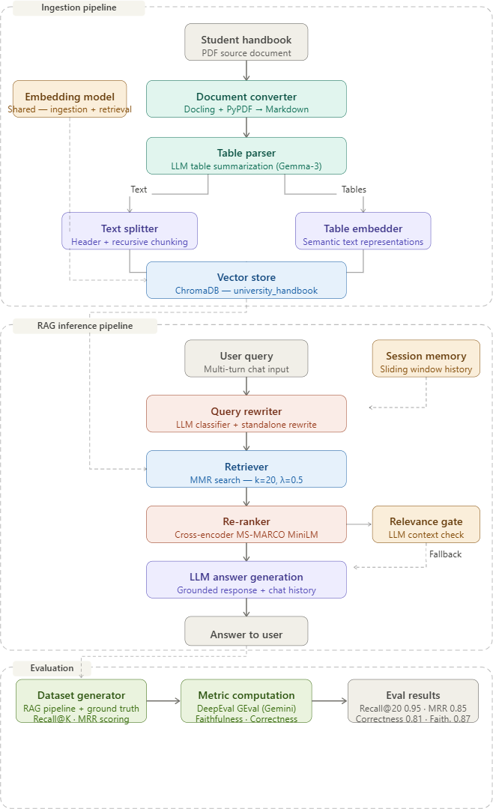

# Ahmedabad University Student Handbook — RAG Chatbot

A production-grade conversational retrieval-augmented generation (RAG) system that transforms the Ahmedabad University student handbook into a fully searchable, conversational knowledge base. The system supports multi-turn dialogue, semantic retrieval, cross-encoder reranking, and automated evaluation.

---

## Overview

This project builds a domain-specific conversational chatbot over the Ahmedabad University student handbook PDF. The system employs a multi-stage RAG architecture that goes beyond naive vector search — it combines layout-aware document parsing, LLM-powered table enrichment, hierarchical text chunking, Max Marginal Relevance retrieval, cross-encoder reranking, and a query rewriting module to support natural multi-turn conversations.

The pipeline is split into two independently runnable phases:

- **Ingestion** — converts the PDF into a searchable Chroma vector database
- **Inference** — serves conversational queries against the indexed knowledge base

An offline evaluation suite measures both retrieval quality (Recall@K, MRR) and generation quality (faithfulness, answer relevancy, correctness) using RAGAS-style metrics.

---

## Architecture



---

## Installation

**Prerequisites**: Python 3.10 or higher.

```bash
# Clone the repository
git clone https://github.com/your-org/au-handbook-rag.git
cd au-handbook-rag

# Create and activate a virtual environment
python -m venv .venv
source .venv/bin/activate      # Windows: .venv\Scripts\activate

# Install dependencies
pip install -r requirements.txt
```

### Dependencies

| Package | Purpose |
|---|---|
| `docling` | Layout-aware PDF parsing |
| `pypdf` | Page count and batch-range extraction |
| `langchain-core` | Document abstractions, prompt chains, output parsers |
| `langchain-community` | Chroma vector store integration |
| `langchain-google-genai` | Google Generative AI LLM wrapper |
| `chromadb` | Local persistent vector database |
| `sentence-transformers` | Cross-encoder reranking model |
| `deepeval` | LLM-as-a-judge evaluation framework |
| `google-generativeai` | Gemini model access for evaluation |

---

## Ingestion Pipeline

### Document Converter

`ingestion/document_converter.py`

The `DocumentProcessor` class uses Docling's `DocumentConverter` as the primary parsing engine. PyPDF first computes total page count to enable batch-wise processing (`BATCH_SIZE = 10`). Each batch is parsed into clean Markdown preserving headings, lists, and document hierarchy. Batches are concatenated and saved to `data/handbook.md` for caching and reproducibility.

### Table Parser

`ingestion/table_parser.py`

The `TableParser` separates Markdown into narrative text blocks and table blocks using regex. For each detected table, it runs an LLM-powered summarization chain (LangChain + Gemma-3-1B-IT, temperature=0) that produces a 2-3 sentence description capturing column names, row labels, key metrics, and notable values. Each table is stored as a LangChain `Document` with `type=table` metadata, making tabular content fully queryable via semantic search.

### Text Splitter

`ingestion/text_splitter.py`

The `TextSplitter` applies a two-stage strategy:

1. `MarkdownHeaderTextSplitter` — splits on `#`, `##`, `###` headers to preserve document hierarchy
2. `RecursiveCharacterTextSplitter` — further splits on `\n\n`, newline, sentence, and space boundaries with `chunk_size=2500` and `chunk_overlap=250`

This produces balanced, context-preserving chunks optimized for embedding quality and LLM context windows.

### Vector Store

`ingestion/vector_store.py`

The `VectorStore` class wraps LangChain's Chroma integration. It automatically creates the `vector_db/` directory for on-disk persistence and indexes all processed `Document` objects using `Chroma.from_documents()`. The collection persists across runs, enabling fast reloads without re-embedding.

---

## RAG Inference Pipeline

### Retriever

`rag/retriever.py`

The `Retriever` class connects to the persisted ChromaDB collection and converts it into a retriever using Max Marginal Relevance (MMR) search. MMR balances semantic similarity with result diversity to reduce redundant context. Configuration: `k=20`, `lambda_mult=0.5`.

### Re-ranker

`rag/reranker.py`

After MMR retrieval returns 20 candidate chunks, the `Reranker` applies a cross-encoder (`cross-encoder/ms-marco-MiniLM-L-6-v2`) to score each `(query, document)` pair with full bidirectional attention. Chunks are sorted by score and the top 4 are passed to the LLM. This bi-encoder/cross-encoder hybrid architecture achieves high recall at retrieval and high precision at generation.

### Query Rewriter

`rag/query_rewriter.py`

The `QueryRewriter` uses a two-stage LLM gating approach:

1. **Classifier** — determines whether the latest user message is self-contained or depends on chat history
2. **Rewriter** — if context-dependent, rewrites the query into a fully standalone semantic search query, resolving pronouns and incorporating prior constraints

Chat history is managed with a sliding window of the last 4 turns. The module returns both the rewritten query and a boolean flag for observability.

### RAG Orchestration

`rag/rag_pipeline.py`

The `RAGPipeline` class coordinates all components:

1. Load session chat history via `SessionManager`
2. Classify and optionally rewrite the query
3. Retrieve 20 candidates with MMR
4. Rerank to top 4 with the cross-encoder
5. Validate context relevance with a secondary LLM gate; trigger fallback retrieval if needed
6. Generate a grounded answer using the original (not rewritten) user query and chat history
7. Update session memory and return the full diagnostic payload

---

## Evaluation

### Dataset Generation

`evaluation/dataset_generator.py`

This script runs the full RAGPipeline against a curated set of evaluation queries with known ground-truth chunk IDs. For each query it captures the generated answer, retrieved context, latency, relevance status, fallback usage, and query rewriting activity. It also computes the rank of the ground-truth chunk within the final reranked results to derive Recall@K and MRR scores.

```bash
python evaluation/dataset_generator.py
# Outputs: evaluation/generated_eval_dataset.json
```

### Metric Computation

`evaluation/metric_computation.py`

Implements LLM-as-a-judge evaluation using DeepEval's GEval framework backed by a custom `ChatGoogleGenerativeAI` (Gemini-3.1-Flash-Lite) integration. A GEval Correctness metric is configured to evaluate factual accuracy while ignoring tone and wording differences. The script runs batch evaluation with retry logic and exponential backoff for rate limiting.

```bash
python evaluation/metric_computation.py
# Outputs: average correctness score across all eval samples
```

---

## Performance Metrics

| Metric | Score | Stage |
|---|---|---|
| Recall@20 | 0.95 | Retrieval |
| Recall@4 | 0.89 | Reranking |
| MRR@4 | 0.85 | Reranking |
| Faithfulness | 0.87 | Generation |
| Answer relevancy | 0.86 | Generation |
| Correctness | 0.81 | Generation |

**Retrieval** is the strongest stage. A Recall@20 of 0.95 indicates excellent knowledge base coverage and embedding quality. After reranking, Recall@4 of 0.89 and MRR@4 of 0.85 confirm the cross-encoder reliably surfaces the correct chunk near the top of a small context window.

**Generation** is healthy. Faithfulness at 0.87 indicates the LLM is largely grounded in retrieved context with minimal hallucination. Answer relevancy at 0.86 validates the effectiveness of query rewriting and prompt design. Correctness at 0.81 leaves a meaningful gap, attributed primarily to partial retrieval misses and occasional multi-hop reasoning failures.

The most impactful path to improvement is pushing correctness from 0.81 toward 0.90+ through context window optimization, stronger reranking, or prompt refinement.

---

## Design Decisions

**Batch-wise PDF ingestion** — processing the PDF in 10-page batches prevents memory spikes on large academic documents and makes the pipeline production-ready without requiring a high-memory machine.

**LLM table summarization** — raw Markdown tables are opaque to embedding models. Generating a dense semantic description alongside each table makes tabular policy data (fees, grading, schedules) retrievable via natural language queries.

**Two-stage text splitting** — header-aware splitting preserves semantic section boundaries; recursive character splitting ensures chunks fit within LLM context windows without breaking mid-sentence.

**MMR over pure similarity search** — returning 20 diverse candidates at retrieval prevents the reranker from receiving 20 near-duplicate chunks when a topic is densely covered in the handbook.

**Cross-encoder reranking** — bi-encoder embeddings index at scale but score pairs independently. Cross-encoders attend jointly to query and document, yielding significantly better ranking precision at the cost of running only on the small candidate set.

**Query rewriting with gating** — rewriting every query wastes LLM calls. The classifier gate ensures rewriting only fires on genuinely context-dependent follow-ups, keeping latency low for self-contained questions.

**Relevance gate with fallback** — a secondary validation step catches cases where retrieval returns irrelevant chunks (e.g., overly specific or ambiguous queries) and retries with a broadened query rather than hallucinating an answer.

---
